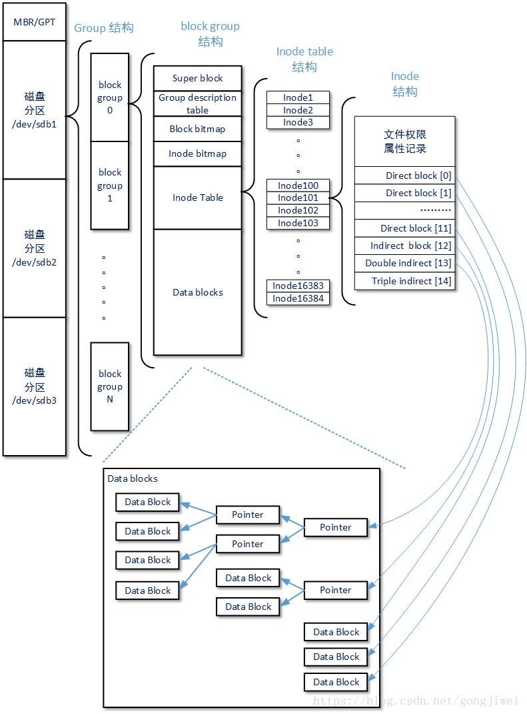
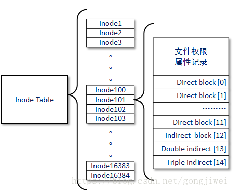
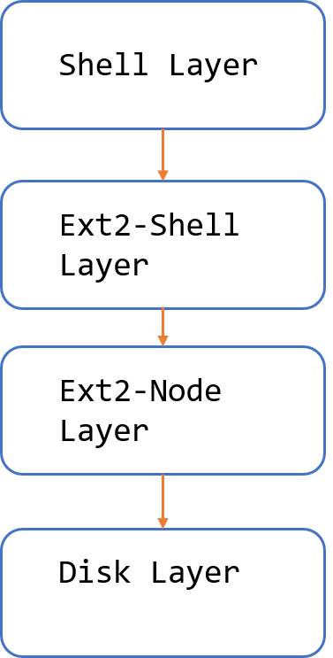
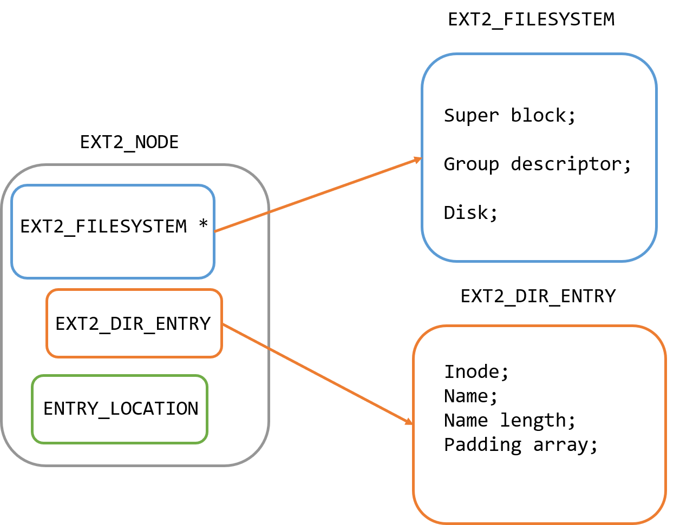

# EXT2 文件系统设计随记
> Zicheng Zhang
[toc]

## 引言

本文是笔者在实现ext2文件系统中的一些随记

主要分为两个部分：

* ext2 文件系统基础认识
* ext2文件系统实现
* C 语言高级语法
* Makefile 用法

## Ext2 文件系统基础认识

### 磁盘的物理组成

扇区(sector)为最小的物理存储单位，每个扇区(sector)为512字节。
将扇区组成一个圆，那就是柱面，柱面是分区的最小单位。
第一个扇区很重要，里面有硬盘主引导记录（Masterbootrecord,MBR）及分区表，其中MBR占有446字节，分区表占有64字节。

**磁盘分区**

是告诉操作系统“我这块磁盘在此分区可以访问的区域是A柱面到B柱面之间的块”，这样操作系统就知道它可以在所指定的块内进行文件数据的读、写、查找等操作。磁盘分区即指定分区的起始与结束柱面。

一个磁盘可以划分成多个分区，每个分区必须先用格式化工具（如mkfs命令）格式化成某种格式的**文件系统**，然后才能存储文件，格式化过程中会在磁盘上写一些管理存储布局的信息。一个分区只能格式化成一个文件系统

### 文件系统特性

再磁盘分区完成之后我们必须要格式化(format) ,之后OS才能够使用这个分区。通常我们可以称呼一个可被挂载（mount）的数据为一个文件系统而不是一个分区。

> 较新的操作系统的文件数据除了文件实际内容外， 通常含有非常多的属性，例如 Linux 操作系统的文件权限(rwx)与文件属性(拥有者、群组、时间参数等)。 文件系统通常会将这两部份的数据分别存放在不同的区块，权限与属性放置到 inode 中，至于实际数据则放置到 data block 区块中。 另外，还有一个超级区块 (superblock) 会记录**整个文件系统**的整体信息，包括 inode 与 block 的总量、使用量、剩余量等

每一inode 和 superblock 都有编号：

**superblock**：记录此 filesystem 的整体信息，包括inode/block的总量、使用量、剩余量， 以及文件系统的格式与相关信息等

**inode**：记录文件的属性，一个文件占用一个inode，同时记录此文件的数据所在的 block 号码；

**block**：实际记录文件的内容，若文件太大时，会占用多个 block 。

### EXT2 文件系统概貌



文件系统中存储的最小单元是块(block),一个块的大小是在格式化的时候确定的

### EXT2 group block

**superblock**

**超级块**(Super Block)描述**整个分区**的文件系统信息，如inode/block的大小、总量、使用量、剩余量，以及文件系统的格式与相关信息。超级块在每个块组的开头都有一份拷贝（第一个块组必须有，后面的块组可以没有）。 为了保证文件系统在磁盘部分扇区出现物理问题的情况下还能正常工作，就必须保证文件系统的super block信息在这种情况下也能正常访问。所以一个文件系统的super block会在多个block group中进行备份，这些super block区域的数据保持一致。

**GDT（Group Descriptor Table）**

由很多块组描述符(Group Descriptor)组成，整个分区分成多个块组就对应有多少个块组描述符。

每个块组描述符存储**一个块组**的描述信息，如在这个块组中从哪里开始是inode Table，从哪里开始是Data Blocks，空闲的inode和数据块还有多少个等等。块组描述符在每个块组的开头都有一份拷贝。

**Block Bitmap**

**块位图**(Block Bitmap)用来描述整个块组中哪些块已用哪些块空闲。块位图本身占一个块(block)，其中的每个bit代表本块组的一个block，这个bit为1代表该块已用，为0表示空闲可用。假设格式化时block大小为1KB，这样大小的一个块位图就可以表示1024*8个块的占用情况，因此一个块组最多可以有10248个块。

**Inode Bitmap**

**inode位图**(inode Bitmap)和块位图类似，本身占一个块，其中每个bit表示一个inode是否空闲可用。 Inode bitmap的作用是记录block group中Inode区域的使用情况，Ext文件系统中一个block group中可以有16384个Inode，代表着这个Ext文件系统中一个block group最多可以描述16384个文件。

**Inode Table**

由一个块组中的所有inode组成。一个文件除了数据需要存储之外，一些描述信息也需要存储，如文件类型，权限，文件大小，创建、修改、访问时间等

这些信息存在inode中而不是数据块中。inode表占多少个块在格式化时就要写入块组描述符中

 在Ext2/Ext3文件系统中，每个文件在磁盘上的位置都由文件系统block group中的一个Inode指针进行索引，Inode将会把具体的位置指向一些真正记录文件数据的block块，需要注意的是这些block可能和Inode同属于一个block group也可能分属于不同的block group。我们把文件系统上这些真实记录文件数据的block称为Data blocks。

Inode Table 中 Inode 的结构



### Dive Into Ext2

#### 扇区(sector)与块(block)的区别

产看磁盘的扇区
```shell
sudo fdisk -l

```
部分信息
```shell
Disk /dev/sda：120 GiB，128849018880 字节，251658240 个扇区
单元：扇区 / 1 * 512 = 512 字节
扇区大小(逻辑/物理)：512 字节 / 512 字节
I/O 大小(最小/最佳)：512 字节 / 512 字节
磁盘标签类型：dos
磁盘标识符：0x9e733b2d

设备       启动      起点      末尾      扇区  大小 Id 类型
/dev/sda1  *         2048   2000895   1998848  976M 83 Linux
/dev/sda2         2002942  18001919  15998978  7.6G  5 扩展
/dev/sda3        18001920 118001663  99999744 47.7G 83 Linux
/dev/sda4       118001664 251658239 133656576 63.8G 83 Linux
/dev/sda5         2002944  18001919  15998976  7.6G 82 Linux swap / Solaris

分区表记录没有按磁盘顺序。
```

扇区是最小的物理存储单元,每个扇区为512byte

使用dumpe2fs查看块的大小：单位Byte
```shell
sudo dumpe2fs /dev/sda1 | grep "Block size:"
```
```shell
Block size:               4096
```
> ext2 文件系统支持的 Block 的大小有 1024 字节、2048 字节和 4096 字节

#### 理解inode和block

* `superblock`:记录了整个文件系统的整体信息，包括inode/block的总量使用量，剩余量，以及文件系统的格式与相关信息
* `inode` :记录文件的属性，一个文件占用一个`inode` 同时会记录此文件的数据所在的block号码
* `block` ：实际记录文件的内容，若文件太大，会占用多个`block`

由于每个 inode 与 block 都有编号，而每个文件都会占用一个 inode ，inode 内则有文件数据放置的 block 号码。 因此，我们可以知道的是，如果能够找到文件的 inode 的话，那么自然就会知道这个文件所放置数据的 block 号码， 当然也就能够读出该文件的实际数据了。这是个比较有效率的作法，因为如此一来我们的磁盘就能够在短时间内读取出全部的数据， 读写的效能比较好。

#### Inode 的特色

* 每个inode大小均为固定的128bytes
* 每一个文件都仅仅会占用一个inode而已
* 系统读取文件时需要先找到 inode，并分析 inode 所记录的权限与用户是否符合，若符合才能够开始实际读取 block 的内容
* inode 本身并不记录文件名称，文件名称是记录在目录的block中的

### EXT2目录与文件

每个文件(不管是一般文件还是目录文件)都会占用一个 inode ， 且可依据文件内容的大小来分配多个 block 给该文件使用。而我们知道目录的内容在记录文件名， 一般文件才是实际记录数据内容的地方

#### 目录

当我们在 Linux 下的 ext2 文件系统创建一个目录时， ext2 会分配一个 inode 与至少一块 block 给该目录。其中，inode 记录该目录的相关权限与属性，并可记录分配到的那块 block 号码； 而 block 则是记录在这个目录下的文件名与该文件名占用的 inode 号码数据。

#### 文件

当我们在 Linux 下的 ext2 创建一个一般文件时， ext2 会分配一个 inode 与相对于该文件大小的 block 数量给该文件。例如：假设我的一个 block 为 4 Kbytes ，而我要创建一个 100 KBytes 的文件，那么 linux 将分配一个 inode 与 25 个 block 来储存该文件！ 但同时请注意，由于 inode 仅有 12 个直接指向，因此还要多一个 block 来作为区块号码的记录喔

#### 目录树

inode本身并不记录文件名,文件名的记录是在目录的block当中,那么因为文件名是记录在目录的 block 当中， 因此当我们要读取某个文件时，就务必会经过目录的 inode 与 block ，然后才能够找到那个待读取文件的 inode 号码， 最终才会读到正确的文件的 block 内的数据

## Ext2文件系统实现

### 概述

#### 目标

* 理解ext2 体系结构的基础上自己设计类ext文件系统
* 底层用内存空间去模拟磁盘空间
* 简单的实现了cd,touch,ls,mkdir,rm,rmdir,fill 等命令

#### 设计结构

按功能需求对类ext2文件系统做了四层封装



工程目录：

.
├── common.h
├── disk.h
├── disksim.c
├── disksim.h
├── entrylist.c
├── ext2.c
├── ext2.h
├── ext2_shell.c
├── ext2_shell.h
├── Makefile
├── shell.c
├── shell.h
└── types.h

0 directories, 13 files


下面对每一个层进行介绍

### ext2 文件系统常量参数的定义

扇区大小：512Byte

块大小：1024Byte

Inode大小: 128Byte

目录名称最大长度: 11 Byte

shell  缓冲区的大小: 13

磁盘空间大小：268435456+1024

这些基本信息定义在`ext2.h`头文件中

`ext2.h` 中部分宏定义

```c
#define SHELL_BUFFER_SIZE       13 // shell 缓冲区的大小

#define TOTAL_DISK_SIZE         (268435456 + MAX_BLOCK_SIZE) // 需要加一个Boot block 的位置
#define MAX_SECTOR_SIZE         512 //扇区是最小的物理存储单元,每个扇区为512byte
#define MAX_BLOCK_SIZE          (MAX_SECTOR_SIZE*2) // 1024 ext2 文件系统支持的 Block 的大小有 1024 字节、2048 字节和 4096 字节，如果要存储的文件大多数是几 KB 的小文件，那么选择 1 KB 的块尺寸能提高磁盘存储空间的利用率

#define MAX_NAME_LENGTH         256
#define MAX_ENTRY_NAME_LENGTH   11
// 两种不同类型的BLOCKS
#define EXT2_D_BLOCKS			12 // 直接寻址得到
#define EXT2_N_BLOCKS         	15
#define MAX_BLOCK_GROUP_SIZE	(8 * MAX_BLOCK_SIZE * MAX_BLOCK_SIZE) // 定义block group 的最大大小
#define NUMBER_OF_SECTORS       (TOTAL_DISK_SIZE/MAX_SECTOR_SIZE) // 扇区的总数
#define NUMBER_OF_GROUPS        ((TOTAL_DISK_SIZE-MAX_BLOCK_SIZE)/MAX_BLOCK_GROUP_SIZE) /* 块组的个数,注意计算的时候要减去boot block */
#define NUMBER_OF_BLOCK         (TOTAL_DISK_SIZE/MAX_BLOCK_SIZE) // 块的个数
#define NUMBER_OF_INODES        (NUMBER_OF_BLOCK/2) //一般block数量不小于inode个数，一般为1，2，4倍
#define INODE_SIZE              128 //每个 inode 大小均固定为 128 bytes

```

### Disk Layer

该层基本设计思想：

* 利用了堆栈空间去模拟磁盘空间
* 定义了`disk`这一个承载物理磁盘功能的数据结构
* 定义了磁盘初始化函数`disksim_init` 主要用于初始化堆栈空间
* 定义了磁盘读写的接口`disksim_write`,`disksim_read`

API 接口

```c
int disksim_init(SECTOR, unsigned int, DISK_OPERATIONS *);
void disksim_uninit(DISK_OPERATIONS *);
int disksim_read(DISK_OPERATIONS *this, SECTOR sector, void *data);
int disksim_write(DISK_OPERATIONS *this, SECTOR sector, const void *data);

```

`DISK_OPERATIONS` 数据结构定义如下

```c
typedef struct DISK_OPERATIONS{
    // 声明了两个函数指针供读写硬盘
    // 读写扇区
    int (* read_sector) (struct DISK_OPERATIONS *,SECTOR,void *);
    int (* write_sector) (struct DISK_OPERATIONS *,SECTOR,const void *);
    SECTOR numberOfSectors; // 扇区数量
    int bytesPerSector; // 每一个扇区的字节数量
    void *pdata; // 指向heap上的指针(也就是我们的"物理磁盘")
} DISK_OPERATIONS;
```

`disksim_init` 中提供了实例化disk的途径

```c
memset(((DISK_MEMORY *) disk->pdata)->address, 0, bytesPerSector * (numberOfSectors));
disk->read_sector = disksim_read;
disk->write_sector = disksim_write;
disk->numberOfSectors = numberOfSectors;
disk->bytesPerSector = bytesPerSector;
```

`disksim_init` 函数会在主程序一开始执行的时候就调用

### EXT2-Node Layer

EXT2-Node Layer 是ext2 文件系统的核心部分，向下它提供了与物理磁盘交互的接口，向上它提供了接口，将shell 层与物理磁盘隔离开来。

`ext2.h` 定义了必要的数据结构

`ext2.c` 定义了操作细节

#### Data Structure

**基本数据结构**

super_block 实现时主要参考了linux kernel 中的源码

> [linux/fs/ext2/ext2.h](https://github.com/torvalds/linux/blob/master/fs/ext2/ext2.h)

```c
typedef struct{
    UINT32 max_inode_count; //inode count
    UINT32 block_count; // 
    UINT32 reserved_block_count; // 保留没有使用的文件块数
    UINT32 free_block_count; // 可用的文件块数
    UINT32 free_inode_count; 
    UINT32 first_data_block; // 第一个数据块的索引
    UINT32 log_block_size; //数据块的大小
    UINT32 log_fragmentation_size; // 碎片文件大小
    UINT32 block_per_group; //每一组的块数
    UINT32 fragmentation_per_group; // 每一组的碎片数目
    UINT32 inode_per_group; //每一组节点总数
    UINT32 mtime; // 最近被安装到内存的时间
    UINT32 wtime; // 最近被修改的时间
    UINT16 mount_count; // 最近一次文件系统查后被安装的次数
    UINT16 max_mount_count; // 最大可以安装的次数
    UINT16 magic_signature; //  文件系统的标识
    UINT16 state; // 文件系统的状态
    UINT16 errors; /*Behaviour when detecting errors */
    UINT16 minor_version;
	UINT32 last_consistency_check_time;
	UINT32 check_interval; /* max. time between checks */
	UINT32 creator_os;
	UINT16 UID_that_can_use_reserved_blocks;
	UINT16 GID_that_can_use_reserved_blocks;
	UINT32 first_non_reserved_inode;
	UINT16 inode_structure_size;
	UINT16 block_group_number;
	UINT32 compatible_feature_flags;
	UINT32 incompatible_feature_flags;
	UINT32 read_only_feature_flags;
	UINT32 UUID[4];
	UINT32 volume_name[4];
	UINT32 last_mounted_path[16];
	UINT32 algorithm_usage_bitmap;
	UINT8 preallocated_blocks_count;
	UINT8 preallocated_dir_blocks_count;
	BYTE padding[2];
	UINT32 journal_UUID[4];
	UINT32 journal_inode_number;
	UINT32 journal_device;
	UINT32 orphan_inode_list;
	UINT32 hash_seed[4];
	UINT8 defined_hash_version;
	BYTE padding1;
	BYTE padding2[2];
	UINT32 default_mount_option;
	UINT32 first_data_block_each_group;
	BYTE reserved[760];
} EXT2_SUPER_BLOCK;
```

组描述符(group descriptor)的定义,大小为32-bytes

```c
typedef struct
{
	UINT32 start_block_of_block_bitmap; //存放 block_bitmap所在block的索引
	UINT32 start_block_of_inode_bitmap; //存放文件节点位图的块的索引
	UINT32 start_block_of_inode_table; //文件节点表在外存中的第一块的索引
	UINT16 free_blocks_count; // 可用的文件块数
	UINT16 free_inodes_count; // 可用的文件节点数
	UINT16 directories_count; // 使用中的目录数
	BYTE padding[2]; // 用于32-bit地址的对齐
	BYTE reserved[12];
} EXT2_GROUP_DESCRIPTOR;
```

将group descriptor 组织成 group descriptor table

```c
typedef struct{
	EXT2_GROUP_DESCRIPTOR group_descriptor[NUMBER_OF_GROUPS];
}EXT2_GROUP_DESCRIPTOR_TABLE;
```

Inode 是ext2 中最为重要的数据结构，每一个Inode 对应一个文件实体，记录了文件的关键信息，同时记录了文件存储在哪些block中，笔者能力有限仅仅实现了一级指针，没有实现二级指针，三级指针。

```c
typedef struct
{
	UINT16  mode; // 文件类型
	UINT16  uid; // Low 16 bits of Owner Uid
	UINT32  size; // size in bytes
	UINT32  atime; // 访问时间
	UINT32  ctime; //创建时间
	UINT32  mtime; //修改时间
	UINT32  dtime; // 删除时间
	UINT16  gid; //Low 16 bits of Group id
	UINT16  links_count; // Links count
	UINT32  blocks; // 文件所占用的块
	UINT32  flags; // File flags
	UINT32  i_reserved1;
	UINT32  block[EXT2_N_BLOCKS]; // 存放的文件可能占有多个block
	UINT32  generation; // File version
	UINT32  file_acl; // File ACL
	UINT32  dir_acl; // Directory ACL
	UINT32  faddr; // Fragment address
	UINT32  i_reserved2[3];
} INODE;
```

Inode Table  

```c
// Inode table for each group
typedef struct{
	INODE inode[INODES_PER_GROUP];
}EXT2_INODE_TABLE;
```

Inode 块位表 和 Block 块位表

```c
// inode_bitmap
typedef struct{
	BYTE block_bitmap[MAX_BLOCK_SIZE]; // block块位使用
}EXT2_BLOCK_BITMAP;

typedef struct
{
	BYTE inode_bitmap[MAX_BLOCK_SIZE]; 
}EXT2_INODE_BITMAP;
```

**高层数据结构**

为了更好的抽象出ext2中的实体，我们需要对之前所定义的数据结构进行进一步的封装。

文件目录信息(EXT2_DIR_ENTRY)主要是将Inode 数据结构进一步封装

```c
typedef struct{
	UINT32 inode; // inode number 4byte 记录下inode的编号，供在Inode Table中查找，通过该项可以获得文件信息
	char name[MAX_ENTRY_NAME_LENGTH]; //File name 11 byte
	UINT32 name_len; // 4byte
	BYTE pad[13]; // 13 byte 填充对齐
} EXT2_DIR_ENTRY;
```

> 因为Inode 里面是不含有文件名称的

EXT2_FILESYSTEM 数据结构主要将,super_block , Group_descriptor 和 disk 进行封装

```c
//ext2 文件系统
typedef struct{
	EXT2_SUPER_BLOCK 	 	sb; // 超级块
	EXT2_GROUP_DESCRIPTOR 	gd; // 组描述符
	DISK_OPERATIONS *		disk; // 物理磁盘
}EXT2_FILESYSTEM;
```

将文件的位置信息封装成一个数据结构EXT2_DIR_ENTRY_LOCATION

```c
// 文件的定位
typedef struct{
	UINT32 group; //所在组块号
	UINT32 block; //所在块号
	UINT32 offset; //块内偏移
} EXT2_DIR_ENTRY_LOCATION;
```
文件的实际内容和文件属性共同组织成我们ext2 layer 层的最大的数据结构
EXT2_NODE

```c
typedef struct{
	EXT2_FILESYSTEM * fs; // 记录了实际内容
	EXT2_DIR_ENTRY entry; // 记录了文件目录信息
	EXT2_DIR_ENTRY_LOCATION location;
} EXT2_NODE;
```

为了更加清晰地展示高层数据结构的关系，我们用下图来说明




#### API 

在`ext2.c`中实现了一下API

```c
int ext2_format(DISK_OPERATIONS* disk);
int ext2_create(EXT2_NODE* parent, char* entryName, EXT2_NODE* retEntry);
int ext2_lookup(EXT2_NODE* parent, char* entryName, EXT2_NODE* retEntry);
int fill_super_block(EXT2_SUPER_BLOCK * sb);
int fill_descriptor_table(EXT2_GROUP_DESCRIPTOR_TABLE * gd, EXT2_SUPER_BLOCK * sb);
int create_root(DISK_OPERATIONS* disk, EXT2_SUPER_BLOCK * sb);
typedef int(*EXT2_NODE_ADD)(void*, EXT2_NODE*);
int block_write(DISK_OPERATIONS* this, SECTOR sector, void* data);
int block_read(DISK_OPERATIONS* this, SECTOR sector, void* data);
UINT32 get_free_inode_number(EXT2_FILESYSTEM* fs);
UINT32 get_free_block_number(EXT2_FILESYSTEM* fs);
int init_super_block(DISK_OPERATIONS* disk, EXT2_SUPER_BLOCK* sb, UINT32 group_number);
int init_gdt(DISK_OPERATIONS* disk, EXT2_GROUP_DESCRIPTOR_TABLE * gdt, UINT32 group_number);
int init_block_bitmap(DISK_OPERATIONS* disk, UINT32 group_number);
int init_inode_bitmap(DISK_OPERATIONS* disk, UINT32 group_number);
int set_bit(SECTOR number, BYTE* bitmap);
int dump_memory(DISK_OPERATIONS* disk, int sector);
int validate_sb(void* block);
int get_inode(EXT2_FILESYSTEM* fs, UINT32 inode_num, INODE *inodeBuffer);
int read_root_block(EXT2_FILESYSTEM* fs, BYTE* block);
int read_superblock(EXT2_FILESYSTEM* fs, EXT2_NODE* root);
int format_name(EXT2_FILESYSTEM* fs, char* name);
int lookup_entry(EXT2_FILESYSTEM* fs, int inode, char* name, EXT2_NODE* retEntry);
int find_entry_at_block(BYTE* sector, char* formattedName, UINT32 begin, UINT32 last, UINT32* number);
int set_inode_bitmap(EXT2_FILESYSTEM* fs, EXT2_INODE_BITMAP* i_bitmap, EXT2_BITSET bitset);
int set_block_bitmap(EXT2_FILESYSTEM* fs, EXT2_BLOCK_BITMAP* b_bitmap, EXT2_BITSET bitset);
int insert_inode_table(EXT2_NODE* parent, INODE* inode_entry, int free_inode);
int set_sb_free_block_count(EXT2_NODE* NODE, int num);
int	set_sb_free_inode_count(EXT2_NODE* NODE, int num);
int	set_gd_free_block_count(EXT2_NODE* NODE,UINT32 free_data_block,int num);
int	set_gd_free_inode_count(EXT2_NODE* NODE,UINT32 free_inode_block,int num);
int set_entry( EXT2_FILESYSTEM* fs,EXT2_DIR_ENTRY_LOCATION* location, EXT2_DIR_ENTRY* value );
int insert_entry(EXT2_NODE *, EXT2_NODE *, UINT16 );
```

这些API 被分为几类

* ext2_command function：读写ext2_Node ，ext2_entry ,创建删除 

* init function: 初始化 super_block，descriptor table，块位图

* read function : 读出super_block 中的信息

* get function：查询函数，例如：查询空闲的block,根据inode 号查询inode，查询目录名称

* set function：设置函数，这些函数供init function 调用，内含一些清空函数

* utility function：功能函数，主要作为功能模块供上面的调用，例如：规范化文件名称

  > 设计时我们将文件名一律转化为大写格式

我们自底向上的，有选择地介绍这些函数

在底层的功能函数中，最核心的是`block_write`,`block_read` 函数，这两个函数是ext2 Layer 和 disk Layer 的接口，一个逻辑块（block）可能含有多个扇区（sector）

```c
// 对block写入
int block_write(DISK_OPERATIONS *this,SECTOR block,void *data){
    int i;
    int result;
    int sectorNUM=block*SECTORS_PER_BLOCK;
    // 逻辑块中包含了多个扇区逐个写入
    for(i=0;i<SECTORS_PER_BLOCK;i++){
        result=disksim_write(this,sectorNUM+i,data+(i*MAX_SECTOR_SIZE));
    }
    return result;
}
// 从block 读出
int block_read(DISK_OPERATIONS *this,SECTOR block,void *data){
    int i;
    int result;
    int sectorNUM=block*SECTORS_PER_BLOCK;  // 通过block 号计算出 扇区号
    //逻辑块中包含了多个扇区逐个读出
    for(i=0;i<SECTORS_PER_BLOCK;i++){
        result=disksim_read(this,sectorNUM+i,data+(i*MAX_SECTOR_SIZE));
    }
    return result;
}
```

在get function 中一个比较重要的函数是`get_inode`，即根据 inode number 寻到 block 中的Inode 实体。这是后面展开对文件读写的关键。

```c
// 根据inode的编号，在文件系统中获取对应的Inode
// inode,superblock 这些本身也属于块的范畴
int get_inode(EXT2_FILESYSTEM *fs,UINT32 inode_num,INODE *inodeBuffer){
    BYTE block[MAX_BLOCK_SIZE];// 块缓冲区
    inode_num--;
    UINT32 group_number=inode_num / INODES_PER_GROUP;  // 所在组号
    UINT32 group_inode_offset=inode_num % INODES_PER_GROUP; // 所在的组内偏移
    UINT32 block_number=group_inode_offset / INODES_PER_BLOCK; // 所在的块号
    UINT32 block_inode_offset=group_inode_offset % INODES_PER_BLOCK; // 所在的块内偏移
    // 基址+(组块号*每组块数)+组内块偏移
    // 将disk中寻址得到的inode block的读到 block
    block_read(fs->disk,INODE_TABLE_BASE+(group_number*BLOCKS_PER_GROUP)+block_number,
    block);
    // 将block拷贝到inodeBuffer(block(base)+组内的偏移）
    memcpy(inodeBuffer, block + (INODE_SIZE * (block_inode_offset)), sizeof(INODE));
    
}
```

在ext2 command 函数中定义了一个十分重要的函数，格式化函数（format function）

```c
int ext2_format(DISK_OPERATIONS *disk){
    EXT2_SUPER_BLOCK sb;
    EXT2_GROUP_DESCRIPTOR_TABLE gdt;
    EXT2_INODE_BITMAP ib;
    EXT2_BLOCK_BITMAP bb;
    EXT2_INODE_TABLE it;
    int i;
    // 填充super_block,descriptor_table
    if(fill_super_block(&sb)!=EXT2_SUCCESS){
        return EXT2_ERROR;
    }
    if(fill_descriptor_table(&gdt,&sb)!=EXT2_SUCCESS){
        return EXT2_ERROR;
    }
    init_inode_bitmap(disk,i);
    // 对每个组初始化,写入磁盘
    for(i=0;i<NUMBER_OF_GROUPS;i++){
        sb.block_group_number=i;
        init_super_block(disk,&sb,i);
        init_gdt(disk,&gdt,i);
        init_block_bitmap(disk,i);
    }
    PRINTF("max inode count                : %d\n", sb.max_inode_count);
    PRINTF("total block count              : %u\n", sb.block_count);
    PRINTF("byte size of inode structure   : %u\n", sb.inode_structure_size);
    PRINTF("block byte size                : %u\n", MAX_BLOCK_SIZE);
    PRINTF("total sectors count            : %u\n", NUMBER_OF_SECTORS);
    PRINTF("sector byte size               : %u\n", MAX_SECTOR_SIZE);
    PRINTF("\n");
    create_root(disk,&sb);
    return EXT2_SUCCESS;
}
```

格式化主要是向物理扇区，按以逻辑块为单位，向每个组块填充初始化，super_block，group_descriptor_table，block_bitmap。

### Ext2-Shell Layer

Ext2-Shell 层是位于Shell 层（交互命令层）和Ext2 层（实体层）之间的一层，是Ext2 层与Shell 层的桥梁，对Ext2 的数据结构进行了进一步的封装。

#### 数据结构

在Ext2_Node的基础上，引入了shell_entry

```c
typedef struct SHELL_ENTRY{
    struct SHELL_ENTRY * parent;
    unsigned char name[256];
    unsigned char isDirectory;
    unsigned int size;
    unsigned short permition; // 权限
    SHELL_FILETIME createTime;
    SHELL_FILETIME modifyTime;
    char pdata[1024];  // 本身用来记录一个ext2_Node
} SHELL_ENTRY;
```

我们采用了链表这种数据结构连实现，文件目录的组织

```c
// 将目录组织成一个链表
typedef struct SHELL_ENTRY_LIST_ITEM
{
	SHELL_ENTRY entry;
    struct SHELL_ENTRY_LIST_ITEM * next;
} SHELL_ENTRY_LIST_ITEM;
// 记录链表的头和尾，并且记录链表节点数量
typedef struct{
    unsigned int  count;
    SHELL_ENTRY_LIST_ITEM * first;
    SHELL_ENTRY_LIST_ITEM * last;
}  SHELL_ENTRY_LIST;
```

下面这三个函数定义了如何操作文件目录链表

```c
int		init_entry_list( SHELL_ENTRY_LIST* list );
int		add_entry_list( SHELL_ENTRY_LIST*, struct SHELL_ENTRY* );
void	release_entry_list( SHELL_ENTRY_LIST* );
```


同时还为了shell 中操作定义了，如下数据结构

```c
typedef struct SHELL_FS_OPERATIONS{
    // 面向文件目录,文件目录操作
    int	( *read_dir )( DISK_OPERATIONS*, struct SHELL_FS_OPERATIONS*, const SHELL_ENTRY*, SHELL_ENTRY_LIST* );
	int	( *stat )( DISK_OPERATIONS*, struct SHELL_FS_OPERATIONS*, unsigned int*, unsigned int* );
	int ( *mkdir )( DISK_OPERATIONS*, struct SHELL_FS_OPERATIONS*, const SHELL_ENTRY*, const char*, SHELL_ENTRY* );
	int ( *rmdir )( DISK_OPERATIONS*, struct SHELL_FS_OPERATIONS*, const SHELL_ENTRY*, const char* );
	int ( *lookup )( DISK_OPERATIONS*, struct SHELL_FS_OPERATIONS*, const SHELL_ENTRY*, SHELL_ENTRY*, const char* );
    // 面向文件的操作
    struct SHELL_FILE_OPERATIONS * fileOprs;
    void * pdata; //// 指向EXT2_FILESYSTEM的指针
} SHELL_FS_OPERATIONS;

typedef struct SHELL_FILE_OPERATIONS{
    // 文件创建，删除，读，写
    int	( *create )( DISK_OPERATIONS*, SHELL_FS_OPERATIONS*, const SHELL_ENTRY*, const char*, SHELL_ENTRY* );
	int ( *remove )( DISK_OPERATIONS*, SHELL_FS_OPERATIONS*, const SHELL_ENTRY*, const char* );
	int	( *read )( DISK_OPERATIONS*, SHELL_FS_OPERATIONS*, const SHELL_ENTRY*, SHELL_ENTRY*, unsigned long, unsigned long, char* );
	int	( *write )( DISK_OPERATIONS*, SHELL_FS_OPERATIONS*, const SHELL_ENTRY*, SHELL_ENTRY*, unsigned long, unsigned long, const char* );
}SHELL_FILE_OPERATIONS;
// 文件系统的挂载
typedef struct{
    char * name;
    int (* mount) (DISK_OPERATIONS *,SHELL_FS_OPERATIONS *,SHELL_ENTRY*);
    int (* umount)(DISK_OPERATIONS *,SHELL_FS_OPERATIONS *);
    int (* format) (DISK_OPERATIONS *);
} SHELL_FILESYSTEM;
```

#### API

`ext2_shell.h` 声明了如下函数

 ```c
int fs_mount(DISK_OPERATIONS* disk, SHELL_FS_OPERATIONS* fsOprs, SHELL_ENTRY* root);
void fs_umount(DISK_OPERATIONS* disk, SHELL_FS_OPERATIONS* fsOprs);
int fs_write( DISK_OPERATIONS* disk, SHELL_FS_OPERATIONS* fsOprs, const SHELL_ENTRY* parent, SHELL_ENTRY* entry, unsigned long offset, unsigned long length, const char* buffer );
int	fs_create(DISK_OPERATIONS* disk, SHELL_FS_OPERATIONS* fsOprs, const SHELL_ENTRY* parent, const char* name, SHELL_ENTRY* retEntry);
int fs_lookup(DISK_OPERATIONS* disk, SHELL_FS_OPERATIONS* fsOprs, const SHELL_ENTRY* parent, SHELL_ENTRY* entry, const char* name);
int fs_read_dir(DISK_OPERATIONS* disk, SHELL_FS_OPERATIONS* fsOprs, const SHELL_ENTRY* parent, SHELL_ENTRY_LIST* list);
int fs_mkdir(DISK_OPERATIONS* disk, SHELL_FS_OPERATIONS* fsOprs, const SHELL_ENTRY* parent, const char* name, SHELL_ENTRY* retEntry);
int fs_format(DISK_OPERATIONS* disk);
int fs_remove(DISK_OPERATIONS* disk, SHELL_FS_OPERATIONS* fsOprs, const SHELL_ENTRY* parent, const char* name);
int fs_rmdir(DISK_OPERATIONS* disk, SHELL_FS_OPERATIONS* fsOprs, const SHELL_ENTRY* parent, const char* name);
int fs_read_dir(DISK_OPERATIONS* disk, SHELL_FS_OPERATIONS* fsOprs, const SHELL_ENTRY* parent, SHELL_ENTRY_LIST* list);
int fs_read( DISK_OPERATIONS* disk, SHELL_FS_OPERATIONS* fsOprs, const SHELL_ENTRY* parent, SHELL_ENTRY* entry, unsigned long offset, unsigned long length, char* buffer );

 ```

这些函数主要完成的是ext_entry 与 shell _entry 中的相互转换，同时再此基础上调用了ext2.c 中的函数

以`fs_read`,`fs_write` 为例

```c
// 对ext2_read,write 在shell 层面封装
int fs_read( DISK_OPERATIONS* disk, SHELL_FS_OPERATIONS* fsOprs, const SHELL_ENTRY* parent, SHELL_ENTRY* entry, unsigned long offset, unsigned long length, char* buffer ){
    EXT2_NODE EXT2Entry;
    //ext_entry 与 shell _entry 中的相互转换
    shell_entry_to_ext2_entry(entry,&EXT2Entry);
    // 调用了ext2.c 中的函数
    return ext2_read(&EXT2Entry,offset,length,buffer);
}

int fs_write(DISK_OPERATIONS* disk, SHELL_FS_OPERATIONS* fsOprs, const SHELL_ENTRY* parent, SHELL_ENTRY* entry, unsigned long offset, unsigned long length, const char* buffer){
    EXT2_NODE EXT2Entry;
    shell_entry_to_ext2_entry(entry,&EXT2Entry);
    return ext2_write(&EXT2Entry,offset,length,buffer);
}
```

### Shell Layer

该层主要提供了交互式的接口以及对类linux的命令的解析

定义如下命令解析函数

```c
int shell_cmd_format(int argc, char* argv[]);
int shell_cmd_exit(int argc, char* argv[]);
int shell_cmd_mount(int argc, char* argv[]);
int shell_cmd_touch(int argc, char* argv[]);
int shell_cmd_cd(int argc, char* argv[]);
int shell_cmd_ls(int argc, char* argv[]);
int shell_cmd_mkdir(int argc, char* argv[]);
int shell_cmd_fill(int argc, char* argv[]);
int shell_cmd_rm(int argc, char* argv[]);
int shell_cmd_rmdir(int argc, char* argv[]);

static COMMAND g_commands[] =
{
	{ "cd",		shell_cmd_cd,		COND_MOUNT	},
	{ "mount",	shell_cmd_mount,	COND_UMOUNT	},
	{ "touch",	shell_cmd_touch,	COND_MOUNT	},
	{ "fill",	shell_cmd_fill,		COND_MOUNT	},
	{ "ls",		shell_cmd_ls,		COND_MOUNT	},
	{ "format",	shell_cmd_format,	COND_UMOUNT	},
	{ "mkdir",	shell_cmd_mkdir,	COND_MOUNT	},
	{ "rm",		shell_cmd_rm,		COND_MOUNT	},
	{ "rmdir",	shell_cmd_rmdir,	COND_MOUNT	},
	{ "exit",	shell_cmd_exit,		0	},
};
```


## C 语言用法随记

### `.h` 文件中的 `#ifndef`和 `#define`

`#ifndef/#define/#endif` 防止该头文件被重复引用

所谓的“被重复引用”是指一个头文件在同一个c文件中被include了多次，错误常常是由于include嵌套造成的

格式：

```c
#ifndef A_H // 如果不存在a.h
#define A_H // 就引入a.h

/**
 * ......
 *  ....
 * */

#endif // 最后一句，否则不需要引入

```

### c 语言中 #x的用法
```c
#define STRINGFY(x)         #x // 含义是给x添加“”，将字符常量，常量转变为字符串常量
```

​	含义是给x添加“”，将字符常量，常量转变为字符串常量


### c 语言中下划线变量的默认含义

* 单下划线`_` 表明是标准库变量
* 双下划线`__` 表明是编译器的变量

### c 语言中的函数指针

函数指针是指向函数的指针变量，函数指针可以像一般函数一样用于调用函数，传递参数

参考用法
```c
#include <stdio.h>
 
int max(int x, int y)
{
    return x > y ? x : y;
}
 
int main(void)
{
    /* p 是函数指针 */
    int (* p)(int, int) = & max; // &可以省略
    int a, b, c, d;
 
    printf("请输入三个数字:");
    scanf("%d %d %d", & a, & b, & c);
 
    /* 与直接调用函数等价，d = max(max(a, b), c) */
    d = p(p(a, b), c); 
 
    printf("最大的数字是: %d\n", d);
 
    return 0;
}
```
### extern 关键字
* 引用同一个文件中的变量

利用extern关键字,使用定义在后面的变量
```c
#include<stdio.h>

int func();

int main()
{
    func(); //1
    extern int num;
    printf("%d",num); //2
    return 0;
}

int num = 3;

int func()
{
    printf("%d\n",num);
}
```
* 引用另一个文件中的变量

可以使用extern引用另一个文件中的全局变量

* 引用另一个文件中的函数

## Makefile 的基本写法

### Makefile 基本格式

```makefile
target:prerequisites
	command
	...
```

* target    - 目标文件, 可以是 Object File, 也可以是可执行文件
* prerequisites - 生成 target 所需要的文件或者目标
* make需要执行的命令 (任意的shell命令)，如果其不与“target:prerequisites”在一行，那么，必须以[Tab]开头，如果和prerequisites在一行，那么可以用分号做为分隔

### make  工作流程

在工程目录下输入make命令

* make 会在当前目录下找名字叫"Makefile" 或者 "makefile"的文件
* 如果找到，它会找文件中的第一个目标文件:target,并把这个文件作为最终的目标文件
* 如果目标文件不存在，或者目标文件所依赖的后面的.o 文件的文件修改时间比目标文件新，那么。他就会执行后面所定义的命令来生成edit这个文件
* 如果目标文件所依赖的.o文件也存在，那么make会在当前文件中找目标为.o文件的依赖性，如果找到则再根据那一个规则生成.o文件
* 当然，你的C文件和H文件是存在的啦，于是make会生成 .o 文件，然后再用 .o 文件声明make的终极任务，也就是执行文件edit了

### Makefile 举例

假设我们有一个主程序代码(main.c)、三份函数代码(getop.c、stack.c、getch.c)以及一个头文件(calc.h)

直接编译

```shell
gcc -o calc main.c getch.c getop.c stack.c 
```

简单的makefile

```makefile
cc = gcc
prom = calc
source = main.c getch.c getop.c stack.c
 
$(prom): $(source)
    $(cc) -o $(prom) $(source)
```

但我们现在依然还是没能解决当我们只修改一个文件时就要全部重新编译的问题。而且如果我们修改的是calc.h文件，make就无法察觉到变化了（所以有必要为头文件专门设置一个常量，并将其加入到依赖关系表中）

考虑到在标准的编译过程中，源文件往往是先被编译成目标文件，然后再由目标文件连接成可执行文件的。我们可以利用这一点来调整一下这些文件之间的依赖关系

```makefile
cc=gcc
prom=calc
deps=calc.h
obj=main.o getch.o getop.o stack.o

$(prom):$(obj)
	$(cc) -o $(prom) $(obj)
%.o:%.c $(deps)
	$(cc) -c $< -o $@

clean:
    rm -rf $(obj) $(prom)
```

* 首先是`%.o:%.c`，这是一个模式规则，表示所有的.o目标都依赖于与它同名的.c文件（当然还有deps中列出的头文件）
* `$<` 代表的是依赖关系表中的第一项（如果我们想引用整个依赖关系表，那么就应该使用`$^`）
* 而 `$@` 是当前语句的目标

为了以后可以向工程中添加`.c` 或者 `.h`可能同时就要再手动为obj常量再添加第一个.o文件。

```shell
cc = gcc
prom = calc
deps = $(shell find ./ -name "*.h")
src = $(shell find ./ -name "*.c")
obj = $(src:%.c=%.o) 
 
$(prom): $(obj)
    $(cc) -o $(prom) $(obj)
 
%.o: %.c $(deps)
    $(cc) -c $< -o $@
 
clean:
    rm -rf $(obj) $(prom)
```

解释：

shell函数主要用于执行shell命令，具体到这里就是找出当前目录下所有的.c和.h文件。而$(src:%.c=%.o)则是一个字符替换函数，它会将src所有的.c字串替换成.o，实际上就等于列出了所有.c文件要编译的结果。有了这两个设定，无论我们今后在该工程加入多少.c和.h文件，Makefile都能自动将其纳入到工程中来

### ext2 工程中的makefile

```makefile
SRC=$(shell find ./ -name "*.c") # 找到文件下面所有的.c
SHELLOBJS=$(SRC:%.c=%.o)
CC=gcc
Target=shell

$(Target): $(SHELLOBJS)
	$(CC) -g -o $(Target) $(SHELLOBJS) -Wall
%.o:%.c 
	$(CC) -c $< -o $@

clean:
	rm $(SHELLOBJS)
	rm $(Target)

```

